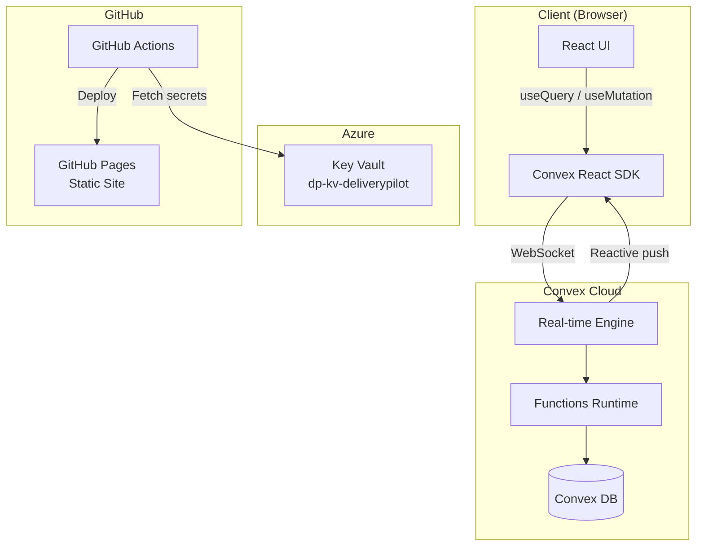
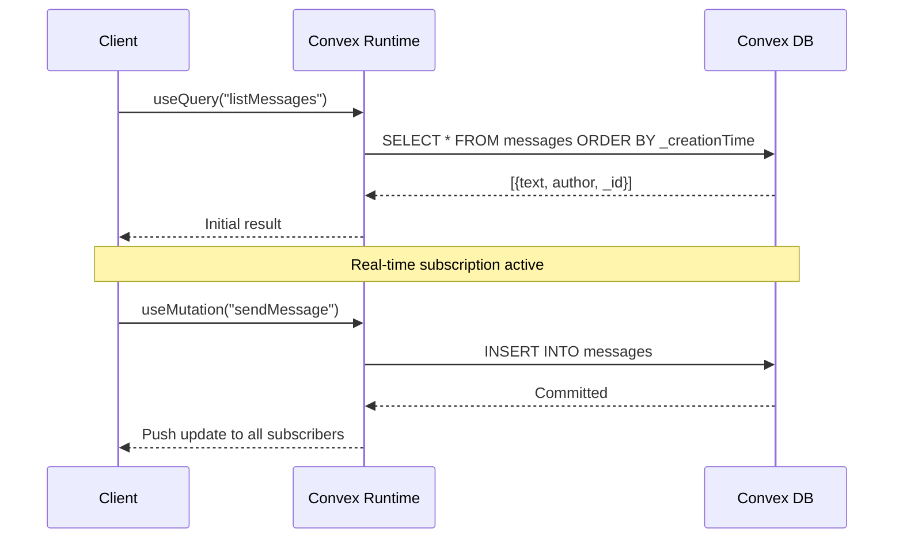

# Architecture — Convex.dev PoC

## System Overview

## Data Flow

## Key Components

| Component | Technology | Purpose |
|-----------|-----------|---------|
| Frontend | React + Vite | UI layer |
| Real-time layer | Convex React SDK | Query subscriptions + mutations |
| Backend functions | Convex (TypeScript) | Business logic, data access |
| Database | Convex DB | ACID-compliant document store |
| Secrets | Azure Key Vault | Deploy key + env vars |
| Hosting | GitHub Pages | Static site delivery |
